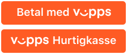
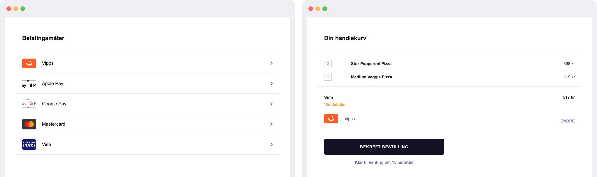
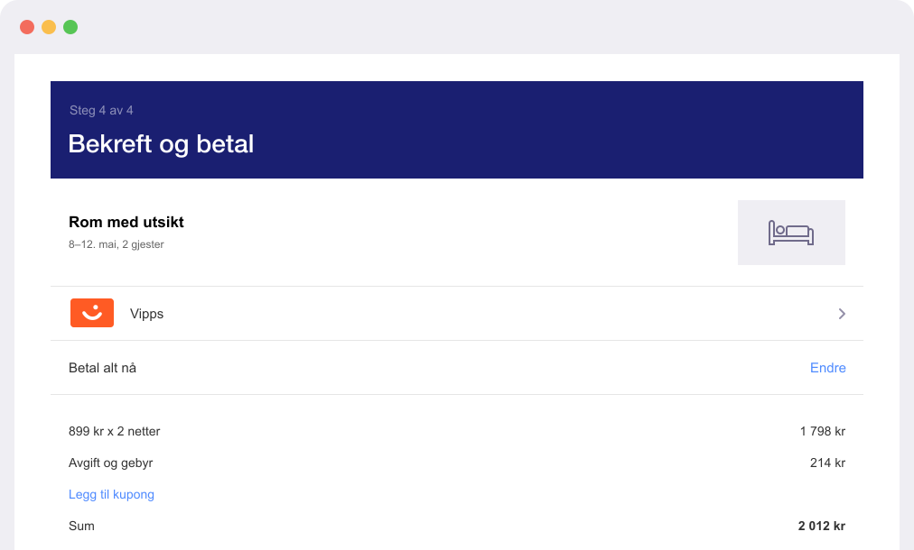

<!-- START_METADATA
---
title: Design guidelines
sidebar_label: Introduction
sidebar_position: 1
hide_table_of_contents: true
pagination_next: null
pagination_prev: null
---
END_METADATA -->

# Design guidelines

💥 Work in progress 💥

**Please note:** These guidelines are under revision. Contact us if you have questions.

<!-- START_METADATA
This content might be better reviewed in GitHub for now. See <https://github.com/vippsas/vipps-design-guidelines>.
END_METADATA -->

These guidelines will help you use the payments buttons, logo, and marks within your websites.

## Vipps buttons

### Style

Vipps buttons are only available in one style: white text on orange.

### Dos and Don’ts

#### ✅ Do

- Use only the buttons provided by Vipps.
- Use the same style of button throughout your site.
- Ensure that the size of the Vipps buttons remains equal to or larger than other buttons.
- Ensure that you choose a background color that contrasts with the button color.

#### 🔥 Don’t

- Don't create your own Vipps buttons or alter the font, color, button radius, or padding within the button in any way.
- Don't use Vipps buttons to initiate any action other than a payment flow.
- Don't make the Vipps button smaller than other buttons.
- Don't use a background color that's similar to the button color.
- Don't add hover effects.

👍 If you place a Vipps button next to another button, make sure the Vipps button is of equal size or larger.

## Vipps logo and mark

Use either the Vipps logo or the Vipps mark when showing Vipps as a payment option. Choose the option that best matches the way in which other payment options are displayed.

### Assets

See <https://github.com/vippsas/vipps-design-guidelines/tree/master/vipps-buttons>.
Download the Vipps logo and mark in `.svg` and `.png` formats.

#### Logo

*Use the Vipps logo with other brand logos.*

If you're using the full logos of other brands to indicate different payment options in your payment flow, favor the Vipps logo over the Vipps mark. Display "Vipps" in text next to the logo if you're doing so for other brands. Don't alter the Vipps logo in any way. Use only the logo provided by Vipps.

#### Mark

*Use the Vipps mark with other brand identities in credit card format.*

If you're using brand identities displayed in credit card format to indicate different payment options in your payment flow, favor the Vipps mark over the Vipps logo. Display "Vipps" in text next to the mark if you're doing so for other brands. Don't change the color or weight of the mark's outline or alter the mark in any way. Use only the mark provided by Vipps.

### Size

Adjust the height to match the other brand identities displayed in your payment flow. Don't make the Vipps logo or mark smaller than other brand identities.

👍 If you use logos to represent payment options, use the Vipps logo and continue to use it throughout your buy flow.

👍 If you use the credit card format to represent payment options, continue to use the Vipps mark throughout your buy flow.

#### Paymarks

Here are paymarks that can be used on front page or product pages:

* [Orange](vipps-paymarks/01-Betal-med-vipps-oransj.png)
* [White](vipps-paymarks/02-Betal-med-vipps-hvit.png)
* [Bubble](vipps-paymarks/03-Betal-med-vipps-boble.png)

See [this PDF](./vipps-paymarks/Vipps-nettbutikker-v.4.0%20utrekk.pdf) for more examples.

### Dos and Don’ts

#### ✅ Do

* Use only the Vipps logo and mark provided by Vipps.
* Use the Vipps logo or mark to indicate Vipps as a payment option during payment flows.
* Choose the logo or mark that best matches the way in which other brand identities are displayed.

#### 🔥 Don’t

* Don't create your own logo or mark or alter them in any way.
* Don't display the Vipps logo or mark in a different or smaller size than the other payment options.

## Using Vipps in text

You may use text to indicate Vipps as a payment option and to promote Vipps in your marketing communication.

### Capitalize the letter "V"

Always use an uppercase "V" followed by lowercase letters. Don't capitalize the full name "Vipps" unless matching the typographic style on your website. Never use an uppercase "Vipps" in your marketing communication.

### Match the style on your website

"Vipps" should be set in the same font and typographic style as the rest of the text on your website. Don't try to mimic Vipps's typographic style.

👍 If you don't display logos for other payment options, "Vipps" should be represented by text.

👍 "Vipps" should be set in the same font and typographic style as the rest of the text on your site.

## Best practices

Maximize your conversions with checkout flows that let customers quickly and easily review their payment information and confirm their purchase.

The following are best practices:

### Make Vipps the primary payment option

People like using Vipps for faster checkout. Where possible, display the Vipps button prominently, and consider making it the default or only payment option.

### Let your customers make purchases without an account

Account creation slows down the checkout process and can lead to abandoned carts. Use Vipps to enable faster guest checkout. If you'd like your customers to create an account, allow them to do so after they complete their purchase.

### Include Vipps on confirmation pages and receipts

When displaying payment information on confirmation pages and email receipts, make sure you indicate the customer has paid with Vipps and ensure that Vipps is displayed consistently with how other payment methods are displayed.

## Additional resources

* [brand.vipps.no](https://brand.vipps.no/)
* [designsystem.vipps.io](https://designsystem.vipps.io)
* [Markedsmateriell](https://www.vipps.no/markedsmateriell/)