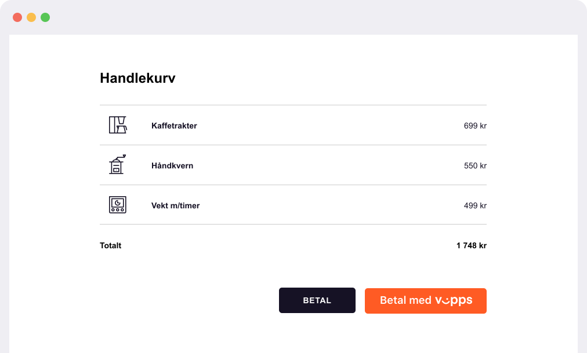

<!-- START_METADATA
---
title: Vipps MobilePay button guidelines
sidebar_label: Button guidelines
sidebar_position: 20
hide_table_of_contents: true
pagination_next: null
pagination_prev: null
---

import ApiSchema from '@theme/ApiSchema';
import Tabs from '@theme/Tabs';
import TabItem from '@theme/TabItem';

END_METADATA -->

# Button guidelines

<!-- START_COMMENT -->
💥 Please use the documentation pages here: <https://developer.vippsmobilepay.com/docs/design-guidelines/>. 💥
<!-- END_COMMENT -->

See the [Vipps MobilePay Design Toolkit on Figma](https://www.figma.com/@vippsmobilepay) to download variations of the Vipps and MobilePay buttons.

<Tabs
defaultValue="vipps"
groupId="brands"
values={[
{label: 'Vipps', value: 'vipps'},
{label: 'MobilePay', value: 'mobilepay'},
]}>
<TabItem value="vipps">

## Style

Vipps buttons are available in white text on orange.

| Rectangular button | Pill button |
| ------------------ | ----------- |
|  |  |

### Exceptions (WCAG AAA)

Our buttons with white text meet the Web Content Accessibility Guidelines (WCAG) demands for AA (mid-range).
If your website must meet the WCAG AAA (the highest accessibility range), you are allowed to render our buttons in higher contrast, either white or black background.
Use `prefers-contrast` and `-ms-high-contrast` CSS media queries to detect if your users have settings that request high contrast.

| Rectangular button | Pill button |
| ------------------ | ----------- |
|  |  |
|  |  |

This exception only applies to color. Don't create your own Vipps or MobilePay buttons or alter the font, button radius, or padding within the button in any other way.

## Approved verbs

<Tabs
defaultValue="english"
groupId="verbs"
values={[
{label: 'English', value: 'english'},
{label: 'Norwegian', value: 'norwegian'},
]}>

<TabItem value="english">

* Pay with Vipps
* Log in with Vipps
* Register with Vipps
* Continue with Vipps

</TabItem>
<TabItem value="norwegian">

* Betal med Vipps
* Logg inn med Vipps
* Registrer med Vipps
* Fortsett med Vipps

</TabItem>
</Tabs>

## Best practices

### ✅ Do

* Use only the buttons provided by Vipps.
* Use the same style of button throughout your site.
* The button text should only use a verb approved by Vipps.
* Ensure that the size of the Vipps buttons remains equal to or larger than other buttons.
* Ensure that you choose a background color that contrasts with the button color.

### 🔥 Don’t

* Don't create your own Vipps buttons or alter the font, color, button radius, or padding within the button in any way.
* Don't use Vipps buttons to initiate any action other than a flow controlled by Vipps (either opening our app or a
  [landing page](https://developer.vippsmobilepay.com/docs/common-topics/landing-page)).
* Don't make the Vipps button smaller than other buttons.
* Don't use a background color that's similar to the button color.
* Don't add hover effects.
* Don't add stroke.

👍 If you place a Vipps button next to another button, make sure the Vipps button is of equal size or larger.

</TabItem>
<TabItem value="mobilepay">

## Style

MobilePay buttons are available in white text on blue.

| Rectangular button | Pill button |
| ------------------ | ----------- |
|  |  |

### Exceptions (WCAG AAA)

Our buttons with white text meet the Web Content Accessibility Guidelines (WCAG) demands for AA (mid-range).
If your website must meet the WCAG AAA (the highest accessibility range), you are allowed to render our buttons in higher contrast, either white or black background.
Use `prefers-contrast` and `-ms-high-contrast` CSS media queries to detect if your users have settings that request high contrast.

| Rectangular button | Pill button |
| ------------------ | ----------- |
|  |  |
|  |  |

This exception only applies to color. Don't create your own Vipps or MobilePay buttons or alter the font, button radius, or padding within the button in any other way.

## Approved verbs

* English: *Pay with MobilePay*
* Danish: *Betal med MobilePay*
* Finish: *Maksa MobilePay*

</TabItem>
</Tabs>

## Best practices

### ✅ Do

* Use only the buttons provided by MobilePay.
* Use the same style of button throughout your site.
* The button text should only use a verb approved by MobilePay.
* Ensure that the size of the MobilePay buttons remains equal to or larger than other buttons.
* Ensure that you choose a background color that contrasts with the button color.

### 🔥 Don’t

* Don't create your own MobilePay buttons or alter the font, color, button radius, or padding within the button in any way.
* Don't use MobilePay buttons to initiate any action other than a flow controlled by MobilePay (either opening our app or a
  [landing page](https://developer.vippsmobilepay.com/docs/common-topics/landing-page)).
* Don't make the MobilePay button smaller than other buttons.
* Don't use a background color that's similar to the button color.
* Don't add hover effects.
* Don't add stroke.

👍 If you place a MobilePay button next to another button, make sure the MobilePay button is of equal size or larger.

</TabItem>
</Tabs>
