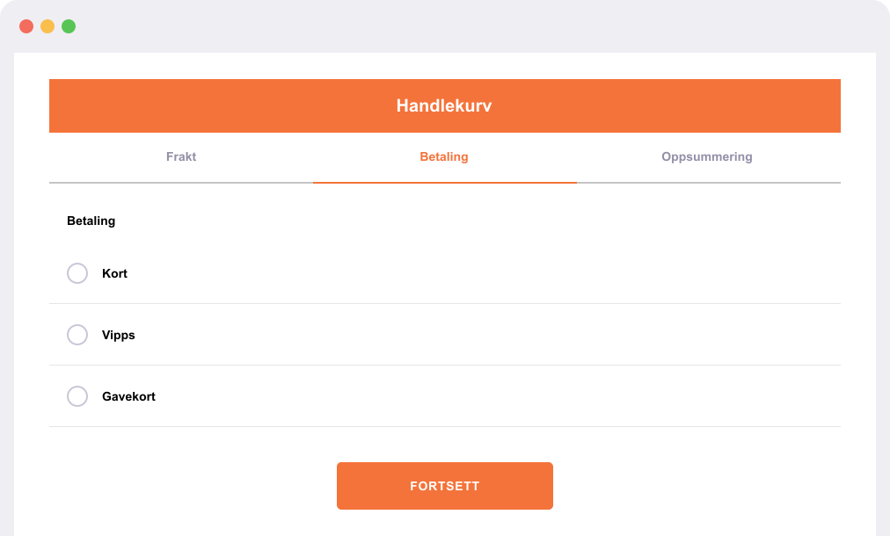
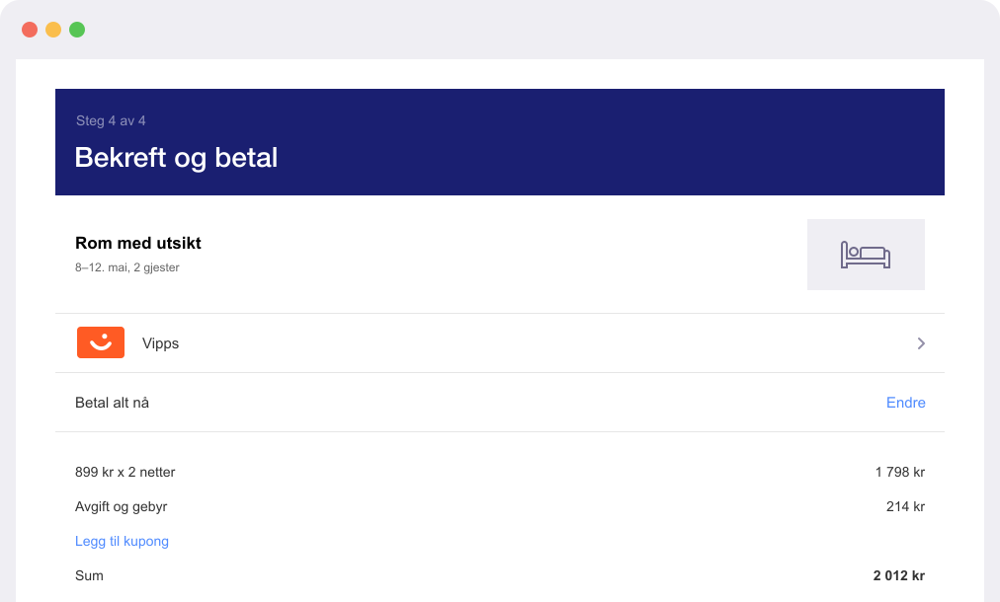

<!-- START_METADATA
---
title: Vipps MobilePay text guidelines
sidebar_label: Text guidelines
sidebar_position: 40
hide_table_of_contents: true
pagination_next: null
pagination_prev: null
---

import ApiSchema from '@theme/ApiSchema';
import Tabs from '@theme/Tabs';
import TabItem from '@theme/TabItem';

END_METADATA -->

# Text guidelines

You may use text to indicate Vipps or MobilePay as a payment option and to promote these in your marketing communication.

<Tabs
defaultValue="vipps"
groupId="brands"
values={[
{label: 'Vipps', value: 'vipps'},
{label: 'MobilePay', value: 'mobilepay'},
]}>
<TabItem value="vipps">

Always use an uppercase "V" followed by lowercase letters. Don't capitalize the full name "Vipps" unless matching the typographic style on your website. Never use all capitals for the *Vipps* in your marketing communication.

The *Vipps*  name should be set in the same font and typographic style as the rest of the text on your website. Don't try to mimic the Vipps MobilePay typographic style.

👍 If you don't display logos for other payment options, *Vipps* should be represented by text.

👍 *Vipps* should be set in the same font and typographic style as the rest of the text on your site.
</TabItem>

<TabItem value="mobilepay">
To be provided.
</TabItem>

</Tabs>