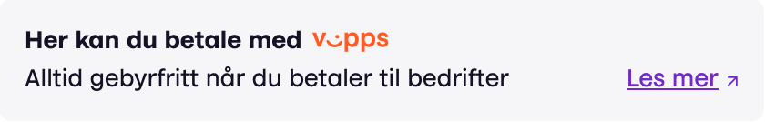
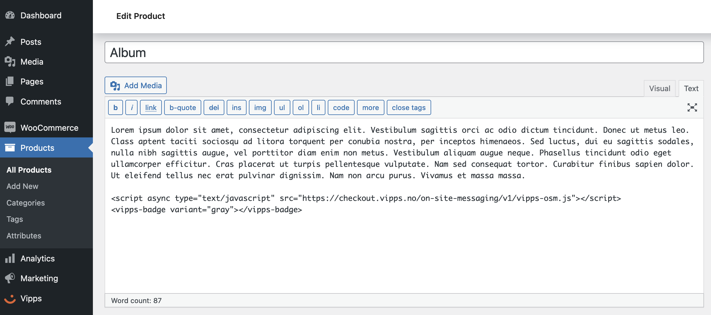
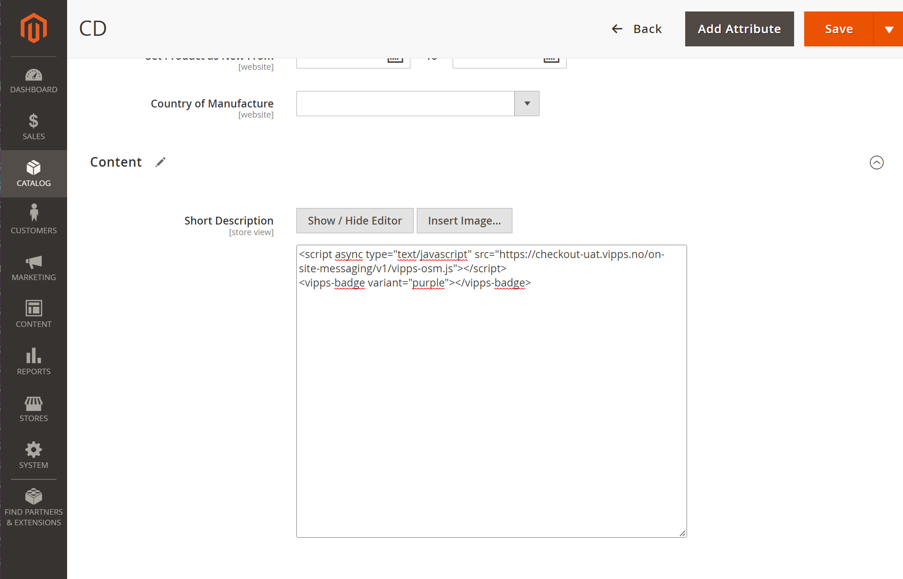

<!-- START_METADATA
---
title: On-site messaging
sidebar_label: On-site messaging
sidebar_position: 70
description: Use On-Site Messaging to let your customers know that a payment is accepted.
pagination_next: null
pagination_prev: null
---
END_METADATA -->

# On-site messaging

Vipps On-Site Messaging contains *badges* in different variants that can be used to let your customers know that Vipps payment is accepted.

To be able to use the badge on your site you need to add the Vipps On-Site Messaging JavaScript library.
The library should preferably be added between your page's `<head>...</head>`-tags and only once per page:

```html
<script async type="text/javascript" src="https://checkout.vipps.no/on-site-messaging/v1/vipps-osm.js"></script>
```

If you don't have access to edit your websites code directly you can also place the JavaScript library just before the chosen badge.

## Badge

The On-Site Messaging library contains an easy to integrate *badge* with tailor made message for use in your online store.
The badge comes in five variants with different color-pallets to suite your website.

### Example badge

You can find a demo and examples of all the variants [here](https://checkout.vipps.no/on-site-messaging/v1).



```html
<vipps-badge variant="gray"></vipps-badge>
```

#### Attributes

All attributes are optional.

| Attribute      | Description                                                                                                                                             | Default |
|:---------------|:--------------------------------------------------------------------------------------------------------------------------------------------------------|:--------|
| `variant`      | The color variant of the badge. Supported values: `white`, `orange`, `gray`, `light-orange`, `purple`.                                                  | `white` |
| `language`     | ISO 639-1 alpha-2 language code. Supported values: `en`, `no`.                                                                                          | `no`    |
| `vipps-senere` | Set this to `true` if your business supports the *Vipps Senere* product.                                                                                | `false` |
| `amount`       | The payable amount in NOK. Amounts are specified in minor units. For Norwegian kroner (NOK) that means 1 kr = 100 øre. Example: 499 kr = 49900 øre.     |         |

#### Customization

You can customize the placement and size of the *badge* by either applying your own CSS-style with the `class` or `style` attribute.

If the badge is too small or too large to fit your content, you can override the `font-size` to scale the *badge* as follows:

```html
<vipps-badge vipps-senere variant="purple" style="font-size: 1.5rem;"></vipps-badge>
```

Which will scale the *badge* to 1.5x the size of the root font-size. You may also use `px` or `em` values to scale the *badge*.

The *badge* is an `inline` element by default, which means it will stay on the same line as sibling elements.

To get the *badge* on the next line you can set `display: block` on the element to prevent it from being `inline`:

```html
<vipps-badge vipps-senere amount="100000" variant="purple" style="display: block;"></vipps-badge>
```

To make the *badge* fill the parent container, set `width: 100%`:

```html
<vipps-badge vipps-senere amount="100000" variant="purple" style="width: 100%;"></vipps-badge>
```

To align the *badge*, you can set `text-align` on the parent container:

```html
<div style="text-align: center;">
  <vipps-badge vipps-senere amount="100000" variant="purple"></vipps-badge>
</div>
```

## Integrations

Here is how to integrate the badge to your products in some of the most used e-commerce platforms.
If you are in need of a more advanced set-up or placement, please consult your e-commerce platform documentation.

### WooCommerce

To add the *badge* to your product in WooCommerce, click to edit the product where you want to display the *badge*.

Under either "Product description" or "Product short description", click the "Text" tab (next to "Visual") - usually in the top right corner of the text area.

Next, just add the JavaScript library and the code snippet for the *badge*:

```html
<script async type="text/javascript" src="https://checkout.vipps.no/on-site-messaging/v1/vipps-osm.js"></script>
<vipps-badge variant="purple"></vipps-badge>
```



### Magento

To add the *badge* to your product in Magento, find your product in *Magento Admin* > *Catalog* > *Products* and open it for edit.
Go to *Content* > *Short Description*, hide the editor, and then paste in the following:

```html
<script async type="text/javascript" src="https://checkout.vipps.no/on-site-messaging/v1/vipps-osm.js"></script>
<vipps-badge variant="purple"></vipps-badge>
```



### Shopify

To add the *badge* to your product in Shopify, find your product in *Shopify Admin* > *Products* and open it. Press the *Show HTML* button and paste in the following:

```html
<script async type="text/javascript" src="https://checkout.vipps.no/on-site-messaging/v1/vipps-osm.js"></script>
<vipps-badge variant="purple"></vipps-badge>
```


